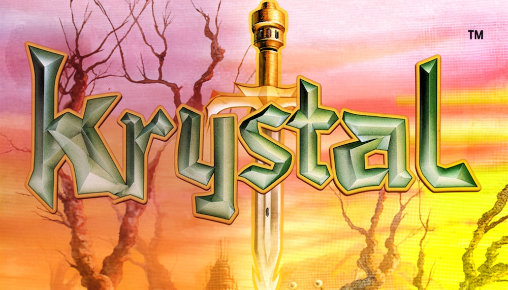

<a href="https://www.krystalballz.xyz/retro">
  
  <h1 align="center">Chat with KBZ live</h1>
</a>

## About 
My name is Mike S and I built KBZ because I am curious about the flow of money to innovative startups. In short, I wanted to be able to ask questions like 'who was funded this month' OR 'any companies that do dev tools'.

Simply put, I use KBZ most days, and, I thought I would make it availalbe to other folks! 

## 🤖 Agents

This SDK includes three specialized AI agents:

### Basic Agent
Standard conversational AI for general-purpose chat and question answering.

### ⏰ Temporal Agent
Time-aware agent that handles scheduling, reminders, and time-sensitive queries with built-in temporal reasoning.

### 📚 Agentic RAG
Retrieval-Augmented Generation agent that searches and synthesizes information from your knowledge base for accurate, sourced responses.

## Socials

- [Twitch](https://www.twitch.tv/krystal_mess323)
- [YouTube](https://www.youtube.com/@krystal_mess323)
- [Twitter](https://x.com/MikeS47896459)
- [LinkedIn](https://www.linkedin.com/in/msylvest55/)
- [Bluesky](https://bsky.app/profile/krystalmess.bsky.social)
- [GitHub](https://github.com/msylvester)

